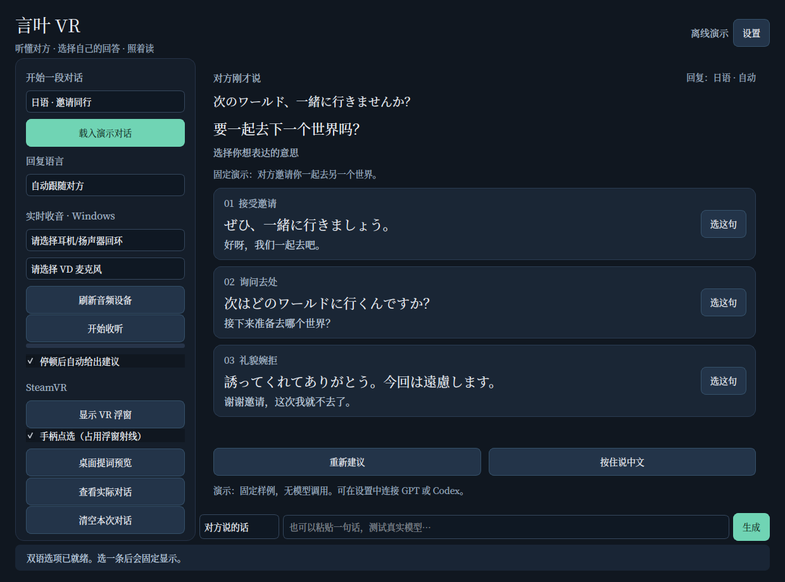
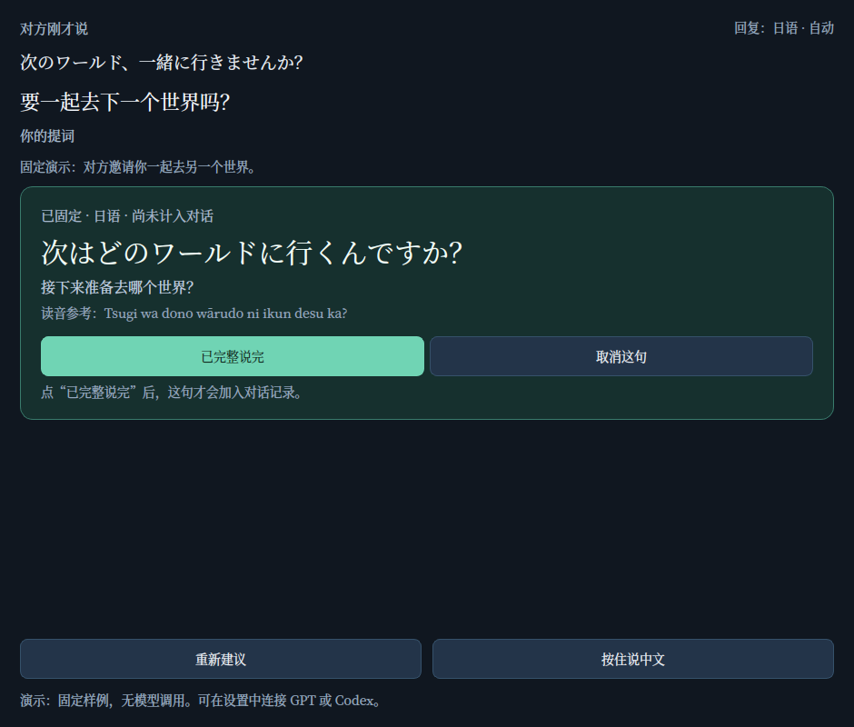

# 言叶 VR · KotonohaVR

[](https://github.com/UyNewNas/KotonohaVR/actions/workflows/ci.yml)

**面向 Windows + SteamVR 的多语言对话助手，首版源码 v0.1.0。**

听懂对方，把自己的心意说出来。

项目仓库：[UyNewNas/KotonohaVR](https://github.com/UyNewNas/KotonohaVR)。

听别人说话，查看原文和中文翻译；选择一条符合自己意思的双语回复，再看着固定提词亲口说出来。回复语言自动跟随对方，支持手动锁定。你说自己的中文想法时，不会把目标语言切回中文。

交互思路参考了 Jev 这类“理解上下文 → 给出回复选项”的助手，本项目代码独立编写。首版的输入是声音和手动粘贴的文字；微信／QQ 截图 OCR、聊天窗口自动监控尚未实现。



## 已实现的使用流程

1. 从耳机／扬声器回环收听对方的声音，按停顿切成短句。
2. 本地 faster-whisper 或 OpenAI 语音 API 转写原文、检测语言。
3. GPT Responses API 或本机 Codex CLI 生成中文翻译与三个不同意图的回复。
4. 每条回复显示外语正文和忠实对应的中文意思。
5. 点选后进入固定提词；新收到的字幕不会覆盖你正在读的句子。
6. 点击 **“已完整说完”** 才把该句计入本人对话历史。“取消”不计入。

也可以按住“说中文”，准备自己的回答。松开后生成一条外语翻译，同样需要你选择并亲口说出。

**使用中文准备回答前，请自己在 VRChat 内静音，并保持 Virtual Desktop 麦克风传输开启。** 本程序没有接管游戏静音，也不会替你开麦、朗读或发送聊天消息。

## 快速开始：先看离线演示

### 使用 Windows 构建包

1. 打开 [GitHub Actions](https://github.com/UyNewNas/KotonohaVR/actions/workflows/ci.yml)，进入一次绿色成功的运行。
2. 在页面下方 **Artifacts** 下载 `KotonohaVR-windows-x64`，完整解压。
3. 双击 **`START_DEMO.cmd`**，或运行 `KotonohaVR.exe`；首次启动默认使用离线演示。
4. 选择日语／英语／韩语样例，试用三条双语回复和固定提词。

构建包包含 Python 运行时，不需要另装 Python。请保留 EXE 旁的 `_internal` 目录；不要只复制 EXE。本地语音识别的模型权重和 Codex CLI 需要分别准备。

### 从源码运行

推荐 Windows 11、64 位 Python **3.12**。首次运行需要联网安装依赖。

1. 解压整个项目，避免只取出某个 `.py` 文件。
2. 安装 Python 3.12，并启用 Python Launcher（`py`）。
3. 双击项目根目录的 **`START_DEMO.cmd`**。
4. 切换日语／英语／韩语，点击“载入演示对话”。
5. 选择一句，检查外语、中文意思和固定提词；试试“取消”和“已完整说完”。

演示使用写在源码中的固定样例，不调用模型，也不会识别任意内容。演示自己的中文想法时，可点击“按住说中文”填入 **“我想在这里再待一会儿”**，再点文本框旁的“生成”。

命令行等价操作：

```powershell
py -3.12 -m venv .venv
.\.venv\Scripts\python.exe -m pip install -e .
.\.venv\Scripts\python.exe -m kotonoha_vr --demo
```

Linux/macOS 可运行桌面演示和测试；首版实时音频与 SteamVR 使用路径面向 Windows。

## 连接真实模型

使用 Windows 构建包时，直接运行 **`KotonohaVR.exe`**。从源码运行时，先双击 **`SETUP_WINDOWS.cmd`** 安装 Windows 音频、VR 和本地识别依赖，再双击 **`START_APP.cmd`**。第一次运行默认仍是演示，请打开“设置”选择回复来源。

### GPT · Responses API

- “回复来源”选择 **GPT · Responses API**。
- 填写你账户可用、支持结构化输出的模型。默认 `gpt-4.1-mini`，可以修改。
- 默认 API 地址：`https://api.openai.com/v1`。
- 在密码框输入 API Key，或者让启动程序的环境已有 `OPENAI_API_KEY`。
- 保存后，在下方“对方说的话”输入一句真实外语并生成，先确认文字链路。

Key 只保存在当前进程内存中，不写入 `settings.json`，也不会出现在 VR 浮窗中。关闭程序后，手工输入的 Key 需要重新填写。自定义地址会接收请求和配置给该地址的凭据，请只填写自己确认的服务。

文本接口使用 `/responses` 和 JSON Schema；只兼容该协议的服务。仅支持 `/chat/completions` 的网关不能直接替换。

### Codex · 本机 CLI

- 本版适配器验证的官方 Codex CLI 为 **0.161.0**，先在终端完成该 CLI 的 `codex login`。
- “回复来源”选择 **Codex · 本机 CLI**。
- “可执行文件”填写 `codex`，或本机对应的完整可执行路径。
- 模型可留空使用 CLI 默认值，也可填写账户可用模型。
- 使用同一个 Windows 用户启动程序，让 CLI 自己处理已有登录。

适配器要求 CLI 支持隔离用户配置、临时执行和结构化输出，并限制到已验证版本。其他版本会给出兼容提示，不会退回到能够执行命令的模式。你现有 CLI 版本不同的话，可以在项目目录独立安装，不必改动原来的 CLI（需要 Node.js/npm）：

```powershell
npm install --prefix .\codex-runtime @openai/codex@0.161.0
.\codex-runtime\node_modules\.bin\codex.cmd login
```

再把设置中的“Codex 可执行文件”填成该 `codex.cmd` 的完整路径。实现与验证细节见 [接口与设计](docs/DESIGN.md) 和 [验证记录](docs/VERIFICATION.md)。本软件不会读取或复制 Codex 登录令牌；也不会读取你工作目录里的项目。

GPT API 与 Codex CLI 各自使用其账户权限和额度。Codex 在这里负责文字理解与回复，**语音识别仍需单独选择本地或语音 API**。CLI 每次调用有进程启动开销，实际对话延迟需要在自己的机器上测量。

## 接入 Quest 3S / Virtual Desktop / VRChat

完整步骤见 [Windows 与 VR 使用说明](docs/WINDOWS_GUIDE.md)。

1. 先通过 Virtual Desktop 进入 PC SteamVR，确认 VRChat 声音和麦克风正常。
2. 在言叶 VR 中刷新设备，选择实际播放 VRChat 声音的耳机／扬声器 **回环设备**。
3. 选择可接收到头显麦克风的输入设备。名称以 Windows 实际列出的设备为准。
4. 在设置中配置语音识别，再点击“开始收听”。
5. 点击“显示 VR 浮窗”。可以放在视野前方、左手或右手。
6. 选择回复，读完后确认；录自己的中文前先在游戏内静音，准备读外语时再自行解除静音。

“手柄点选”使用 SteamVR 浮窗射线。开启时可能占用游戏输入；关闭该选项可以保留只读显示。桌面 `Alt+1/2/3`、`Alt+Enter`、`Esc` 只在本程序有焦点时生效，未实现全局快捷键或独立 Quest 按键绑定。



## 首版范围与实际限制

| 项目 | 当前行为 |
| --- | --- |
| 双语方向 | 中文 + 对方检测到的语言；提供手动语言锁定 |
| 建议 | 三条不同意图；自拟中文生成一条忠实翻译 |
| 语言范围 | 不固定中英；实际支持取决于 ASR 与模型，无法确认时要求手选 |
| 字幕速度 | 短句结束后识别；不是逐词流式字幕。默认停顿 650 ms、片段最长 12 秒 |
| 收音 | Windows 输出端点的混音，可能包含其他程序、音乐和提示音 |
| 多人说话 | 没有玩家身份、逐人分轨或重叠语音分离；不会知道哪位玩家说了哪句 |
| 自动静音 | 未实现；中文准备必须自己在游戏内静音 |
| 历史 | 当前进程内保留最近 20 条实际发言；候选与未读完的句子不自动入历史 |
| 记录 | 不保存音频文件或对话文本；保存非敏感设置；本地 ASR 模型会由依赖缓存 |
| 读音提示 | 模型可以给出简短辅助；不确定时留空，需要时仍应核对实际发音 |
| 微信／QQ | 可以手动粘贴一句文字；没有 OCR 或自动读取窗口 |
| 分发 | 可运行源码；GitHub Actions 构建 Windows 包并检查离线启动，实际头显／收音效果仍需真机验证 |

关闭“停顿后自动给出建议”时，识别出的原文会先显示，需点“重新建议”才进行中文翻译及回复生成。

云端回复会接收最近对话上下文；云端语音识别会接收所选音频片段。应用设置 `store: false` 用于 GPT Responses 请求，但这不代表服务端所有处理与保留规则都被关闭。

## 开发、测试与 Windows 打包

```powershell
.\.venv\Scripts\python.exe -m pip install -e ".[dev,windows]"
.\.venv\Scripts\python.exe -m pytest -q
```

- [验证记录](docs/VERIFICATION.md) 区分模拟协议测试、真实 Qt 集成测试和未完成的硬件实测。
- `.github/workflows/ci.yml` 在 push、pull request 或手动触发时运行 Linux/Windows 测试；测试通过后构建 Windows 包，并实际启动 EXE 生成离线演示截图。运行状态以 [GitHub Actions](https://github.com/UyNewNas/KotonohaVR/actions/workflows/ci.yml) 为准。
- 在一次成功运行的 Artifacts 中下载 Windows 包，解压完整目录后运行 `KotonohaVR.exe`。构建成功与离线启动成功不代表已经完成真实音频或头显验收。
- 在 Windows 上运行 `scripts/build_windows.py` 可用 PyInstaller 生成 `dist/KotonohaVR/`，应分发整个目录。ASR 模型首次使用时下载，不包含在包内。Codex CLI 独立安装。
- `START_*.cmd` 只创建项目自身 `.venv`、安装依赖并运行本程序，不修改系统执行策略。

## 项目结构

| 文件 | 职责 |
| --- | --- |
| `core.py` | 目标语言、历史、请求代次、固定提词与确认规则 |
| `providers.py` | GPT、Codex、离线演示，统一结构化输出与校验 |
| `audio.py` | 设备枚举、短句收音、本地／云端原文转写 |
| `overlay.py` | OpenVR 浮窗、纹理、位置、射线点选 |
| `ui.py` | 桌面设置、对话界面、后台工作队列、VR 面板同步 |
| `settings.py` | 非敏感偏好的加载与保存 |

## 参考资料

- [Jev 项目](https://github.com/jev-chat/jev-chat-jarvis)：交互方向参考。
- [OpenAI Structured Outputs](https://developers.openai.com/api/docs/guides/structured-outputs)：结构化回复协议。
- [OpenAI Speech to text](https://developers.openai.com/api/docs/guides/speech-to-text)：语音转写接口。
- [Codex 非交互模式](https://developers.openai.com/codex/noninteractive/)：CLI 接入方式。
- [Valve IVROverlay](https://github.com/ValveSoftware/openvr/wiki/IVROverlay_Overview)：SteamVR 浮窗能力。
- [Microsoft Loopback Recording](https://learn.microsoft.com/en-us/windows/win32/coreaudio/loopback-recording)：输出端点回环的定义。

原始项目代码采用 MIT 许可。Python、Qt、OpenVR、语音识别依赖及 Codex CLI 使用各自许可与服务条款，未将 Jev 源码复制到本项目。
